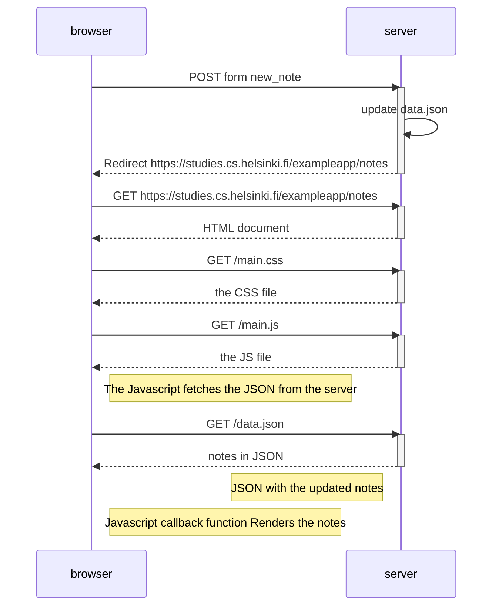

# New note squence diagram

```mermaid
    sequenceDiagram
        participant browser
        participant server


        browser->>server: POST form new_note 
        activate server
        server->>server: update data.json 
        server-->>browser: Redirect https://studies.cs.helsinki.fi/exampleapp/notes
        deactivate server

        browser->>server: GET https://studies.cs.helsinki.fi/exampleapp/notes
        activate server
        server-->>browser: HTML document
        deactivate server

        browser->>server: GET /main.css
        activate server 
        server-->>browser: the CSS file
        deactivate server

        browser->>server: GET /main.js
        activate server 
        server-->>browser: the JS file
        deactivate server

        Note right of browser: The Javascript fetches the JSON from the server

        browser->>server: GET /data.json
        activate server
        server-->>browser: notes in JSON 
        deactivate server

        Note left of server: JSON with the updated notes  
        Note right of browser: Javascript callback function Renders the notes   
```